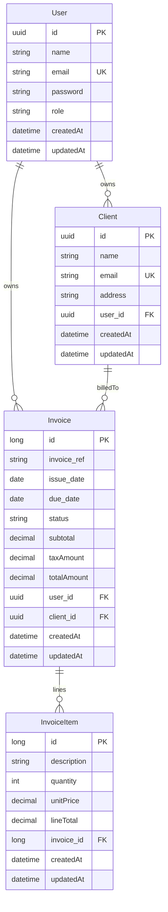

# Invoice Dashboard API

REST backend for managing **users**, **clients**, and **invoices** with line items, backed by PostgreSQL and secured with **JWT** authentication. Built as a portfolio-ready Spring Boot service.

**Repository:** [github.com/boba-milktea/invoice-dashboard-java](https://github.com/boba-milktea/invoice-dashboard-java)

---

## Tech stack

| Layer | Technology |
|--------|------------|
| Runtime | Java **21** |
| Framework | Spring Boot **4.0.6** (Web MVC, Data JPA, Security, Validation) |
| Database | **PostgreSQL** |
| Security | Spring Security, **BCrypt** passwords, **JJWT** |
| Mapping | **MapStruct**, Lombok |
| API docs | **springdoc-openapi** (optional; disabled by default) |

---

## Features

### Authentication

- `POST /api/v1/auth/register` — create an account (password hashed with BCrypt).
- `POST /api/v1/auth/login` — returns a JWT for subsequent requests.

### Users

- `GET /api/v1/users/me`, `PATCH /api/v1/users/me` — current user profile (any authenticated role).
- `GET /api/v1/users`, `GET /api/v1/users/{id}`, `PATCH /api/v1/users/{id}`, `PATCH /api/v1/users/{id}/role`, `DELETE /api/v1/users/{id}` — **super admin only** (`ROLE_SUPER_ADMIN`).

**Role management (`PATCH /api/v1/users/{id}/role`):**

- Only a **super admin** may change roles.
- Allowed targets: `USER` ↔ `ADMIN` only (`SUPER_ADMIN` cannot be assigned via the API).
- A super admin cannot change their own role or demote another super admin.

### Clients

- Full CRUD under `/api/v1/clients` (**admin** and **super admin**).
- `GET /api/v1/clients/search?name=...` — search clients by name.
- **Admin:** all operations are scoped to the authenticated user’s own clients.
- **Super admin:** can list, search, and CRUD **all** clients across users.
- **Create (`POST`):** optional `ownerUserId` in the body — required for super admin (which admin owns the client); ignored for admin (client is always owned by the caller).

### Invoices

- `GET /api/v1/invoices` — paginated list (default: 10 per page, sorted by `createdAt` descending). Admins see their own; super admins see all.
- `GET /api/v1/invoices/due` — invoices needing attention (`OVERDUE`, `PENDING`).
- `GET /api/v1/invoices/search/by-amount?min=&max=` — filter by total amount range.
- `GET /api/v1/invoices/{reference}`, `POST`, `PATCH`, `DELETE` — manage invoices by **reference** (unique per owning user).
- Line items: `POST /api/v1/invoices/{reference}/items`, `PATCH .../items/{itemId}`, `DELETE .../items/{itemId}`.
- **Create (`POST`):** optional `ownerUserId` — same rules as clients; `clientId` must belong to that owner.
- **Patch:** when changing `clientId`, the new client must belong to the **invoice owner** (not necessarily the caller).

**Business rules:**

- Invoice reference is unique **per user** (`user_id` + `invoice_ref`).
- Due date must be on or after the issue date.
- **Subtotal**, **tax**, and **total** are derived from line items; tax uses a **21%** VAT rate on the subtotal.

### Cross-cutting

- Global exception handling for validation, conflicts, and common errors (`GlobalExceptionHandler`).
- Request logging via `LoggingFilter` in the security filter chain.

---

## Security model

### Roles

| Role | Description |
|------|-------------|
| `USER` | Default at registration. Profile (`/users/me`) only; no client or invoice APIs. |
| `ADMIN` | Manages **own** clients and invoices only. |
| `SUPER_ADMIN` | Platform operator: all clients/invoices; user list and role promotion (`USER` → `ADMIN`). |

`SUPER_ADMIN` is **not** assignable via register or `PATCH .../role` — bootstrap one account in the database (see below).

### HTTP rules (`SecurityConfig`)

| Area | Access |
|------|--------|
| `/api/v1/auth/**` | Public (no JWT) |
| `/swagger-ui/**`, `/v3/api-docs/**`, `/error` | Public (useful when OpenAPI is enabled) |
| `GET` / `PATCH` `/api/v1/users/me` | Any **authenticated** user |
| `GET` / `PATCH` / `DELETE` `/api/v1/users/**` (except `/me`) | **`ROLE_SUPER_ADMIN`** |
| `PATCH` `/api/v1/users/{id}/role` | **`ROLE_SUPER_ADMIN`** |
| `/api/v1/clients/**`, `/api/v1/invoices/**` | **`ROLE_ADMIN`** or **`ROLE_SUPER_ADMIN`** |
| All other routes | **Authenticated** (valid JWT) |

`UserController` also uses `@PreAuthorize` (method security is enabled via `@EnableMethodSecurity`) as a second layer on user endpoints.

Service-layer checks further scope data: admins use `userPrincipal.getId()`; super admins use global queries and `ownerUserId` on create (see `AccessHelper`).

### Bootstrap a super admin (local dev)

Registration always creates **`USER`**. Promote to admin via super admin, or set roles in SQL.

If the database was created when the entity was still `Person`, PostgreSQL may still enforce `person_role_check` with only `USER` and `ADMIN`. Hibernate `ddl-auto=update` does not widen that check when `SUPER_ADMIN` is added to the Java enum. Run this once before promoting a user:

```sql
ALTER TABLE users DROP CONSTRAINT IF EXISTS person_role_check;
ALTER TABLE users ADD CONSTRAINT users_role_check
  CHECK (role IN ('SUPER_ADMIN', 'ADMIN', 'USER'));
```

Then promote:

```sql
UPDATE users SET role = 'SUPER_ADMIN' WHERE email = 'your-admin@example.com';
```

Re-login so the JWT carries the updated role.

---

## Database model

### Tables and relationships

| JPA entity | Table | Notes |
|------------|--------|--------|
| `User` | `users` | UUID primary key; 1:N to clients and invoices |
| `Client` | `client` | UUID PK; `user_id` → `users`; 1:N invoices |
| `Invoice` | `invoice` | Long PK (sequence); `user_id`, `client_id`; **unique** `(user_id, invoice_ref)`; 1:N line items |
| `InvoiceItem` | `invoice_item` | Long PK (sequence); `invoice_id` → `invoice` |

### Enums

- **Invoice `Status`:** `DRAFT`, `PENDING`, `PAID`, `OVERDUE`, `CANCELLED`
- **User `Role`:** `SUPER_ADMIN`, `ADMIN`, `USER`

### ER diagram



Hibernate `ddl-auto` is set to `update` for development (see `application.properties`).

---

## Project structure

```
src/main/java/edu/hyf/invoice/
├── InvoiceApplication.java          # Entry point
├── auth/                            # Register, login, logging filter
│   ├── AuthController.java
│   ├── AuthService.java
│   ├── LoggingFilter.java
│   └── dto/
├── config/
│   └── SecurityConfig.java
├── user/                            # User entity, Role, CRUD + /me
├── client/                          # Client CRUD, mapper, repository
├── invoice/                         # Invoice + InvoiceItem, services, Status
├── security/                        # JWT filter, JwtService, UserPrincipal, user details
└── common/
    ├── exception/                   # Domain exceptions, GlobalExceptionHandler
    └── utils/AccessHelper.java      # Resolves owner user id (admin vs super admin)

src/main/resources/
└── application.properties           # Datasource, JPA, server, springdoc flags

application.yml                      # JWT secret and expiration (JWT_SECRET)
src/test/java/                       # Spring Boot tests
```

---

## Getting started

### Prerequisites

- **JDK 21**
- **PostgreSQL**
- **Maven** (or use the included Maven Wrapper `./mvnw`)

### Configuration

1. Create a PostgreSQL database for the app.

2. Add **`env.properties`** at the **project root** (Spring imports `file:env.properties` from `application.properties`):

   ```properties
   DB_DATABASE=your_database_name
   DB_USER=your_username
   DB_PASSWORD=your_password
   ```

3. Set **`JWT_SECRET`** in your environment (used by `application.yml` under `app.jwt.secret`). Use a long, random value in production.

4. Optional: adjust JWT lifetime via `app.jwt.expiration-ms` in `application.yml` (default is 86400000 ms, i.e. 24 hours).

### Run

```bash
./mvnw spring-boot:run
```

The API listens on **port 8080** by default (`server.port` in `application.properties`).

Authenticated requests should send the JWT in the **`Authorization`** header as `Bearer <token>` (see `JwtAuthFilter`).

---

## API documentation (Swagger)

OpenAPI generation and Swagger UI are **turned off** by default:

```properties
springdoc.swagger-ui.enabled=false
springdoc.api-docs.enabled=false
```

To try interactive docs locally, set both to **`true`** in `src/main/resources/application.properties`, restart the app, then open the Swagger UI path (typically `http://localhost:8080/swagger-ui.html` or the redirect under `/swagger-ui/` for your springdoc version). `SecurityConfig` already permits those paths without authentication.

---

## Author

**Catherine** — [catherine.idv@gmail.com](mailto:catherine.idv@gmail.com)

License: **MIT** (see `pom.xml`).
